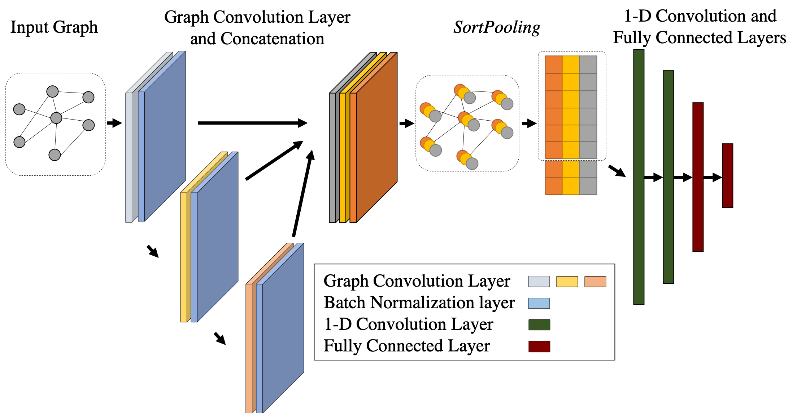

# DVGCN
A PyTorch implementation of "**Multi-Size Computer-Aided Diagnosis of Positron Emission Tomography Images Using Graph Convolutional Networks**" (ISBI 2019).

<p align="center">
  
</p>


<p align="justify">
Convolutional Neural Network (CNN) has shown superior accuracy and generalizability in performing prediction tasks, thanks to its good utilization of the grid-like structure of input images in Euclidean space. In this work we propose the Deep Voxel-Graph Convolution Network (DVGCN). DVGCN represents input images as their affinity graph and performs graph convolution to extract discriminative features. It then utilizes a sortpooling layer to sort the nodes in the graph and unifies the feature size used for prediction across images.</p>

### Requirements

The codebase is implemented in Python 2.7.3. package versions used for development are just below.

```
networkx          1.11
torch             0.4.1
numpy             1.15.4
pandas            0.23.4
scipy             1.1.0
argparse          1.1.0
tensorflow        1.1.0
h5py              2.5.0
scikit-learn      0.20.3
```

### Results

We compare DVGCN with 3D-CNN and traditional radiomics models.

Results on AJCC Staging label:


| Method    | Accuracy  | Sensitivity | Specificity |
| :-------- | :-------: | :---------: | :---------: |
| Radiomics |   0.821   |    0.662    |  **0.981**  |
| 3D-CNN    |   0.711   |    0.642    |    0.779    |
| **DVGCN** | **0.837** |  **0.861**  |    0.813    |

### Installation

First compile s2v_lib then run the main.py  

```shell
cd s2v_lib
make -j4
cd ..
python main.py
```

### Citation

Coming soon...

